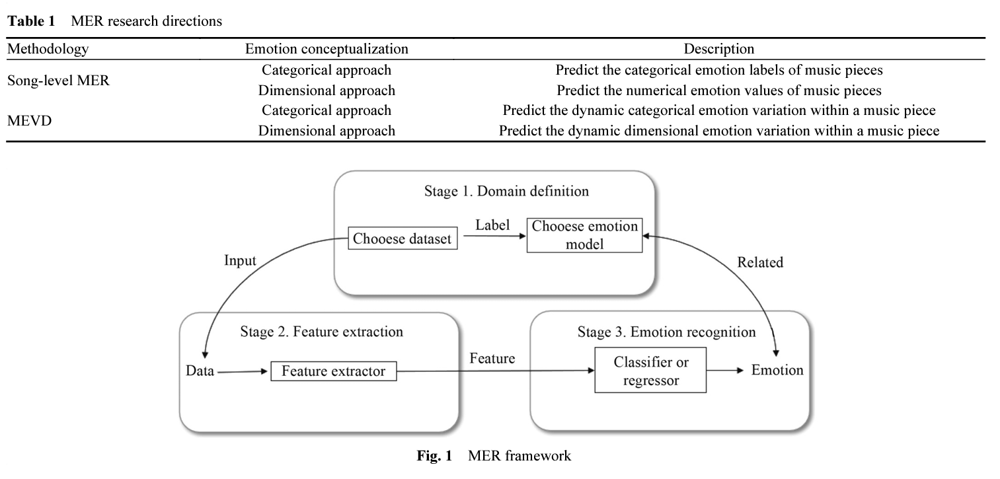

# MER

## June 17, 2022

## Research questions:
* Another question that can be asked (for research in induced emotion in particular) is to decompose the music into multiple instrument, and build a model to recognize the music emotion from there using unsupervised learning (eg. in a particular point or degree of emotion, there is this combination of instrumental energy and lyrics) => Using K nearest neighbor, or some other unsupervised learning algorithms.

## June 15, 2022

### Fruits for thoughts

* Link to most music emotion dataset: https://github.com/juansgomez87/datasets_emotion. Here is the downloadable datasets:
  * **PMEmo dataset** (Induced - Dimensional) ($5.00 price on ACM with student member): The dataset's label is dimensional, it also include `Corresponding EDA physiological signals`. This dataset have labels in pop song music, which include multiple instruments and vocal(s). This dataset also has electrodermal activity dynamically through the song, also has multiple acoustic features for each song.
  * CAL500: western popular music. Categorical (174 labels). Perceived. 2007. 500 full songs.
  * Soundtracks: Film soundtracks. categorical and dimensional (mean rating of valence,energy,tension,anger,fear,happy,sad,tender). Perceived.
  * Emotify: mainly four genres (rock, classical, pop and electronic) music. Geneva Emotional Music Scales (Nine categories (amazement, solemnity, tenderness, nostalgia, calmness, power, joyful activation, tension, sadness)). Induced.
  * 4Q Emotion Dataset: 30-second audio clips for most songs. Mostly popularly consumed music. categorical (Q1 (A+V+), Q2 (A+V-), Q3(A-V-), Q4 (A-V+)). Perceived.
  * **DEAM/MediaVal**: 2058 excerpts (45s long). Dimensional. Perceived. Includes rock, pop, soul, blues, electronic, classical, hip-hop, international, experimental, folk, jazz, country and pop genres.
  * Jamendo Mood and Theme Subset: open dataset for music auto-tagging. 87 genre tags. Categorical: 56 mood/theme tags. Perceived
  * VGMIDI: midi form. 200 MIDI labelled piano pieces (video game soundtracks). dimensional. Perceived.
  * CCMED-WCMED: Western and Chinese classical music recordings (400 excerpts each). dimensional (not time-continuous) (range [-1,1]). Perceived.
  * DEAP dataset (Induced - Dimensional): Use electroencephalogram to record people's emotion with brain activity when they are listening to music. Require permission.
* EDA (often also referred to as galvanic skin response, or GSR) reflects activity of the sympathetic nervous system – the activity of which is dependent on physiological and emotional activation.

## June 14, 2022

### Fruits for thoughts

* There are multiple MER datasets, however, none of the dataset has both emotion label type (induced and perceived). Therefore, one way for us approaching this is to train a model for each dataset (depending on which emotional label type), and use the models which were trained using one emotional label type to infer on the dataset with other emotional label type. Only then, we can work on statistical testing to see if there is any correlation between induced and perceived emotion.

* Additionally, we also can integrate the **context and personalities factors** in the process of user listening to music to see if there is any change in the induced emotion, and how does it correlate with the perceived emotion of the song. For example, when my mood is currently sad, when I listen to a happily perceived song, my induced emotion can vary based on my personality, if I am an optimistic person, I will feel the same way as the song is perceived, but otherwise, I may feel even more depressed.

## Past

### current challenges
* Emotions are subjective and difficult to quantify

### Possible research questions (scoping):
* Create a new music dataset and tested with past researched papers' models, and compare them
* MER: Create optimized deep learning algorithm under dataset constraints
* Are there new representation choice?
* are new new music emotion type conveyed
* Relationship? nice
  * Is there a relationship between the two representation? second
  * Induced and perceived emtion relationship? first
    * The common elements? Will they have similar songs in both dataset type? does dataset have both induced and perceived emotion?
    * Can we learn a model provide label for the other knowing one emotional type.
    * music notation representation? choose one
  * See all rela
  * Existing dataset: analyze their dataset a little more

* Music generation: Musical fusion and transform using generative model
  * Fusing music using unsupervised learning: https://ieeexplore.ieee.org/abstract/document/8215561
  * Fusing using VAE: https://ieeexplore.ieee.org/abstract/document/8215561
* Progressive GAN-like method for music generation algorithm

### Writings:

* Acording to the MER literature survey [10]:
  

* There two type of emotion conveyed by music: induced emotion and perceived emotion. Induced emotion is the emotion felt by human when they listen to a particular piece of music, while perceived emotion is theo type of emotion that are described and conveyed by the the actual piece of music.

* Emotional Representation [9]:
  * Russell's circumplex model (Arousal-Valence emotional map) [6-8]: the emotion of the music is described by a graph with two dimensions, the valence axis (x-axis) represents the emotional positivity (the higher valence the more positive emotion), and the arousal axis (y-axis) represents the emotional intensity (the higher arousal the more energy in the piece of music)
  * Classification

* How do people convey emotions through sound and music?
  * We have to distinguish between the emotions that music convey and the emotions that music evoke (i.e, what emotion is the music itself and how we perceive it). "Induced emotion (also known as felt emotion) is the emotion experienced by the listener whereas the perceived emotion (also known as expressed emotion) is the emotion recognized in the music" [3].

## Resources:
1. Music Emotion dataset: https://github.com/juansgomez87/datasets_emotion
  * A Comparative Study of Western and Chinese Classical Music based on Soundscape Models: https://metacreation.net/ccmed_wcmed_soundscape/
2. Sad music induces pleasant emotion: https://www.frontiersin.org/articles/10.3389/fpsyg.2013.00311/full
3. Perceived and Induced Emotion Responses to Popular Music: Categorical and Dimensional Models: https://www-jstor-org.ezproxy.rit.edu/stable/26417432?seq=1, https://www.eecs.qmul.ac.uk/~simond/pub/2016/SongDixonPearceHalpern-MusicPerception2016-preprint.pdf
4. Music and Emotions in the Brain: Familiarity Matters: https://journals.plos.org/plosone/article?id=10.1371/journal.pone.0027241
5. Expression, Perception, and Induction of Musical Emotions: A Review and a Questionnaire Study of Everyday Listening: https://www.tandfonline.com/doi/pdf/10.1080/0929821042000317813
6. Russell, J.A. A  circumplex  model  of  affect.  J. Personal.  Soc. Psychol. 1980,  38,  1161–1178, doi:10.1037/h0077714.
7. Olson, D.; Russell,  C.S.; Sprenkle,  D.H. Circumplex  Model: Systemic  Assessment and Treatment of Families; Routledge: New York, NY, USA, 2014; pp. 7–40
8. Kuppens,  P.;  Tuerlinckx,  F.;  Yik,  M.;  Koval,  P.;  Coosemans,  J.;  Zeng,  K.J.;  Russell,  J.A.  The  relation between valence and arousal in subjective experience varies with personality and culture. J. Personal. 2017, 85, 530–542, doi:10.1111/jopy.12258.
9. https://www.researchgate.net/publication 330817411_Automatic_Emotion-Based_Music_Classification_for_Supporting_Intelligent_IoT_Applications
10. Han, Donghong, et al. "A survey of music emotion recognition." Frontiers of Computer Science 16.6 (2022): 1-11.
