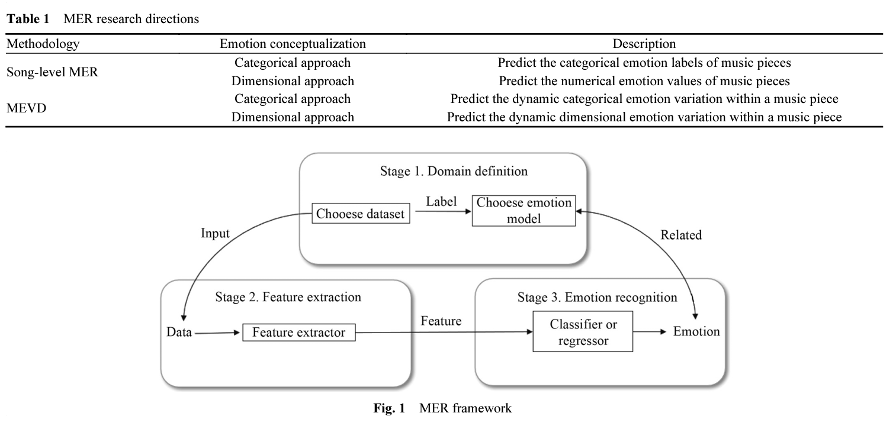

# MER

## August 6, 2022:
* Error on std of arousal and valence: E = z(x^ ; mean, std)
* Augment, sample more data to test with the model (not the training process)
* Every song has different mean and std. Dont minimize the actual loss, we want to minimize the loss in the distribution in each song conceptually.
* Feature of the input as spectorgram or the whole waveform?

## July 28, 2022:
* Feature extraction techniques:
  * Mel-frequency cepstral coefficients (MFCCs)
  * Discrete Wavelet Transform (DWT).

## July 15, 2022:

* Rick: I think the training data provides some good insights: https://sigsep.github.io/datasets/musdb.html . MUSDB simply splits the audio into just 4 tracks: vocal, bass, drum, and "other."  So, training Wav-U-Net on this would mean everything else in the song is "other," and the PMEmo examples have more instruments and timbres than drum, vocal, and bass: https://github.com/HuiZhangDB/PMEmo .  We can think about what to do, but likely we either (1) allow this large "other" and see what happens, (2) train our own version with many more instruments, or (3) only run this version Wav-U-Net on songs in emotion datasets that have mostly vocal, drum, and bass to reduce what appears in "other."

* Alex: I think we can train the wave u net model on a source separation dataset that have their music data most similar to the music emotion dataset (e.g, having similar range of instruments). Here is the link to some music source separation datasets: https://source-separation.github.io/tutorial/data/datasets.html. For example, I saw that the Slakh2100 dataset is has a wide range of instruments (bass, brass, guitar, strings, piano, etc.).
Additionally, one way to predict the emotion separately is to predict the emotion of the lyric. I tried to separate the vocal and the accompaniments wave, we can used the wave to to train a speech recognition model (since we have lyrics label in some music emotion datasets, e.g: PMEmo dataset). Then we can use some natural language processing model (e.g tf-idf or pretrained deep learning model) to infer the emotion of the lyrics. The attachments below are the vocal and accompaniments separated music.

## June 26, 2022: Meeting

* There are multiple machine learning feature for time-series. (Driving paper)
  * Time-series Features:
    * Std in for each window
    * High/low frequency fow each window
    * Galvanic Skin Responses: Mean, max, STD, peak (how often did you get really tense), peak rise time (how long to they get from the lowest value to the highest value)
    * Break down the time-series data to machine learning feature (how many time does do we look at the driving wheel)
  * Related to music machine learning time-series (descriptive) feature:
    * The acoustic of each instrument (drum, guitar, vocal) of the music: mean, std, frequency
    * The chords (major, minor) over time
    * Counting change of events.
    * Descriptive collection of feature (list of semantic description, e.g: where do they look at?)
  * constant value feature and semantic description:
    * The key
    * The tempo

* Ensemble methods:
  * time series forest,
  * Bag of Symbolic features: sample smaller intervals, fourier approximation. Histogram => Count the event in the historgra and identify the trends.
  * Shapelets. We also have time-series feature that human cannot understand. Support vector machine, what is the trend, find the patterns. Shape the data in the other forms. Similar idea to autoencoder.

* It's not what you play, it's how you play it: Timbre.

* How

## June 21, 2022

### Journal Dairies for MER algorithms

* [Deep Learning for Audio Signal Processing](https://arxiv.org/pdf/1905.00078.pdf): A survey for deep learning in audio signal processing
  * Model or Algorithms group:
    * CNN: normal cnn, dilated cnn
    * RNN: RNN, LSTM, GRU, F-LSTM, TF-LSTM, Convolutional Recurrent Neural Network (CRNN)
      * [BiLSTM: Music emotion recognition using recurrent neural networks and pretrained models](https://link.springer.com/article/10.1007/s10844-021-00658-5): this paper use [Marsyas](https://github.com/marsyas/marsyas): has the ability to analyze music files and to output the extracted features. The tool enables the extraction of the following features: Zero Crossings, Spectral Centroid, Spectral Flux, Spectral Rolloff, Mel-Frequency Cepstral Coefficients (mfcc), and chroma features - 31 features in total. For each of these basic features, Marsyas calculates four statistic features (mean, variance and higher-order statistics over larger time windows). The feature vector length obtained from Marsyas was 124.
    * Sequence-to-Sequence Models (transduces an input sequence into an output sequence directly): 
      * connectionist temporal classification (CTC), RNN-T
      * Attention-based models:
        * [multi-scale context based attention model (MCA)](https://www.researchgate.net/publication/320542515_Multi-scale_Context_Based_Attention_for_Dynamic_Music_Emotion_Prediction) 
    * Generative Adversarial Networks (GANs)
*  
* [Bi-Modal Deep Boltzmann Machine Model](https://link.springer.com/chapter/10.1007/978-3-319-44781-0_24): two 2-layer DBM (Deep Boltzmann Machine) networks, one for audio and one for lyrics then an additional layer is added on top to join the two DBMS.

### Idea

## June 20, 2022

* Audio Source Separation is the process of separating a mixture (e.g. a pop band recording) into isolated sounds from individual sources (e.g. just the lead vocals).

### Journal Dairies for MER algorithms
* [audioLime paper]:
  * This paper talk about using audio source separation to analyze music. This paper focus on interpretability for CNN in music spectrogram feature.
  * source-separation based explainer
* [TRACING BACK MUSIC EMOTION PREDICTIONS TO SOUND SOURCES AND INTUITIVE PERCEPTUAL QUALITIES]: 
  *  two-level system: 
    * First, tracing the raw music back to the most relevant mid-level features
    * Second, explain the intermediate mid-level layer via audio sources.
      * Explaining via Audio Sources: audioLIME
      * Explaining via Mid-level Perceptual Features. low-level musical building blocks such as timbre, beat structure, harmony, etc.
  * First, we obtain the mid-level explanation of an emotion by computing the effects. The larger the effect of a mid-level feature, the larger is the contribution of that feature to the emotion prediction. Next, we compute the audioLIME explanations for the mid-level feature with the largest effect (we can in principle compute audioLIME explanations for all features to obtain a more diverse explanation, depending on the application). Given these two explanations, we can describe a prediction as being arrived at by the model due to the explanatory mid-level feature, which is in turn most influenced by the input component given by audioLIME.
* [Using multiple source in evaluation of music emotion](./docs/MUSICMOODDETECTIONBASEDONAUDIOANDLYRICSWITHDEEPNEURALNET.pdf)
* [WAVENET: A GENERATIVE MODEL FOR RAW AUDIO]:
  * Causal Convolution instead of RNN: This is because it can take very long sequence. dilated causal convolutions is used to deal with long-range temporal dependencies needed for raw audio generation.

## June 17, 2022

## Research questions:
* Another question that can be asked (for research in induced emotion in particular) is to decompose the music into multiple instrument, and build a model to recognize the music emotion from there using unsupervised learning (eg. in a particular point or degree of emotion, there is this combination of instrumental energy and lyrics) => Using K nearest neighbor, or some other unsupervised learning algorithms. (Wrong concept)

## June 15, 2022

### Fruits for thoughts

* Link to most music emotion dataset: https://github.com/juansgomez87/datasets_emotion. Here is the downloadable datasets:
  * **PMEmo dataset** (Induced - Dimensional) ($5.00 price on ACM with student member): The dataset's label is dimensional, it also include `Corresponding EDA physiological signals`. This dataset have labels in pop song music, which include multiple instruments and vocal(s). This dataset also has electrodermal activity dynamically through the song, also has multiple acoustic features for each song.
  * CAL500: western popular music. Categorical (174 labels). Perceived. 2007. 500 full songs.
  * Soundtracks: Film soundtracks. categorical and dimensional (mean rating of valence,energy,tension,anger,fear,happy,sad,tender). Perceived.
  * Emotify: mainly four genres (rock, classical, pop and electronic) music. Geneva Emotional Music Scales (Nine categories (amazement, solemnity, tenderness, nostalgia, calmness, power, joyful activation, tension, sadness)). Induced.
  * 4Q Emotion Dataset: 30-second audio clips for most songs. Mostly popularly consumed music. categorical (Q1 (A+V+), Q2 (A+V-), Q3(A-V-), Q4 (A-V+)). Perceived.
  * **DEAM/MediaVal**: 2058 excerpts (45s long). Dimensional. Perceived. Includes rock, pop, soul, blues, electronic, classical, hip-hop, international, experimental, folk, jazz, country and pop genres.
  * Jamendo Mood and Theme Subset: open dataset for music auto-tagging. 87 genre tags. Categorical: 56 mood/theme tags. Perceived
  * VGMIDI: midi form. 200 MIDI labelled piano pieces (video game soundtracks). dimensional. Perceived.
  * CCMED-WCMED: Western and Chinese classical music recordings (400 excerpts each). dimensional (not time-continuous) (range [-1,1]). Perceived.
  * DEAP dataset (Induced - Dimensional): Use electroencephalogram to record people's emotion with brain activity when they are listening to music. Require permission.
* EDA (often also referred to as galvanic skin response, or GSR) reflects activity of the sympathetic nervous system – the activity of which is dependent on physiological and emotional activation.

## June 14, 2022

### Fruits for thoughts

* There are multiple MER datasets, however, none of the dataset has both emotion label type (induced and perceived). Therefore, one way for us approaching this is to train a model for each dataset (depending on which emotional label type), and use the models which were trained using one emotional label type to infer on the dataset with other emotional label type. Only then, we can work on statistical testing to see if there is any correlation between induced and perceived emotion.

* Additionally, we also can integrate the **context and personalities factors** in the process of user listening to music to see if there is any change in the induced emotion, and how does it correlate with the perceived emotion of the song. For example, when my mood is currently sad, when I listen to a happily perceived song, my induced emotion can vary based on my personality, if I am an optimistic person, I will feel the same way as the song is perceived, but otherwise, I may feel even more depressed.

## Past

### current challenges
* Emotions are subjective and difficult to quantify

### Possible research questions (scoping):
* Create a new music dataset and tested with past researched papers' models, and compare them
* MER: Create optimized deep learning algorithm under dataset constraints
* Are there new representation choice?
* are new new music emotion type conveyed
* Relationship? nice
  * Is there a relationship between the two representation? second
  * Induced and perceived emtion relationship? first
    * The common elements? Will they have similar songs in both dataset type? does dataset have both induced and perceived emotion?
    * Can we learn a model provide label for the other knowing one emotional type.
    * music notation representation? choose one
  * See all rela
  * Existing dataset: analyze their dataset a little more

* Music generation: Musical fusion and transform using generative model
  * Fusing music using unsupervised learning: https://ieeexplore.ieee.org/abstract/document/8215561
  * Fusing using VAE: https://ieeexplore.ieee.org/abstract/document/8215561
* Progressive GAN-like method for music generation algorithm

### Writings:

* Acording to the MER literature survey [10]:
  

* There two type of emotion conveyed by music: induced emotion and perceived emotion. Induced emotion is the emotion felt by human when they listen to a particular piece of music, while perceived emotion is theo type of emotion that are described and conveyed by the the actual piece of music.

* Emotional Representation [9]:
  * Russell's circumplex model (Arousal-Valence emotional map) [6-8]: the emotion of the music is described by a graph with two dimensions, the valence axis (x-axis) represents the emotional positivity (the higher valence the more positive emotion), and the arousal axis (y-axis) represents the emotional intensity (the higher arousal the more energy in the piece of music)
  * Classification

* How do people convey emotions through sound and music?
  * We have to distinguish between the emotions that music convey and the emotions that music evoke (i.e, what emotion is the music itself and how we perceive it). "Induced emotion (also known as felt emotion) is the emotion experienced by the listener whereas the perceived emotion (also known as expressed emotion) is the emotion recognized in the music" [3].

## Resources:
1. Music Emotion dataset: https://github.com/juansgomez87/datasets_emotion
  * A Comparative Study of Western and Chinese Classical Music based on Soundscape Models: https://metacreation.net/ccmed_wcmed_soundscape/
2. Sad music induces pleasant emotion: https://www.frontiersin.org/articles/10.3389/fpsyg.2013.00311/full
3. Perceived and Induced Emotion Responses to Popular Music: Categorical and Dimensional Models: https://www-jstor-org.ezproxy.rit.edu/stable/26417432?seq=1, https://www.eecs.qmul.ac.uk/~simond/pub/2016/SongDixonPearceHalpern-MusicPerception2016-preprint.pdf
4. Music and Emotions in the Brain: Familiarity Matters: https://journals.plos.org/plosone/article?id=10.1371/journal.pone.0027241
5. Expression, Perception, and Induction of Musical Emotions: A Review and a Questionnaire Study of Everyday Listening: https://www.tandfonline.com/doi/pdf/10.1080/0929821042000317813
6. Russell, J.A. A  circumplex  model  of  affect.  J. Personal.  Soc. Psychol. 1980,  38,  1161–1178, doi:10.1037/h0077714.
7. Olson, D.; Russell,  C.S.; Sprenkle,  D.H. Circumplex  Model: Systemic  Assessment and Treatment of Families; Routledge: New York, NY, USA, 2014; pp. 7–40
8. Kuppens,  P.;  Tuerlinckx,  F.;  Yik,  M.;  Koval,  P.;  Coosemans,  J.;  Zeng,  K.J.;  Russell,  J.A.  The  relation between valence and arousal in subjective experience varies with personality and culture. J. Personal. 2017, 85, 530–542, doi:10.1111/jopy.12258.
9. https://www.researchgate.net/publication 330817411_Automatic_Emotion-Based_Music_Classification_for_Supporting_Intelligent_IoT_Applications
10. Han, Donghong, et al. "A survey of music emotion recognition." Frontiers of Computer Science 16.6 (2022): 1-11.
